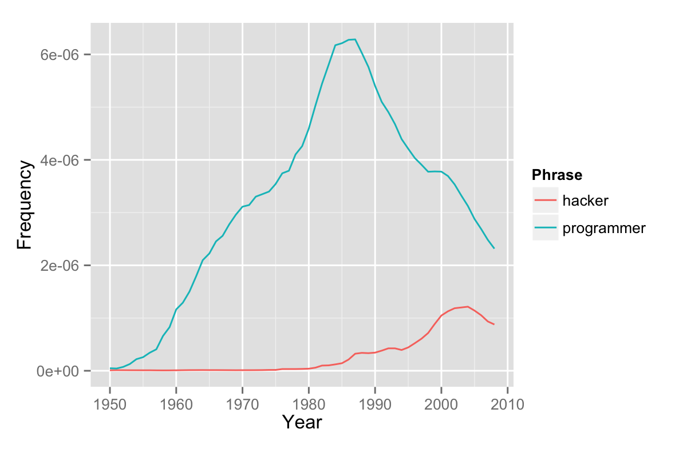

# ngramr - R package to query the Google Ngram Viewer

<!-- badges: start -->

<!-- badges: end -->

<!--  -->

The [Google Books Ngram Viewer][1] allows you to enter a list of phrases and
then displays a graph showing how often the phrases have occurred in a large
corpus of books (e.g., "British English", "English Fiction", "French") over
time. The current corpus produced in 2023 contains around two trillion words
for English alone.

The underlying data is hidden in Web page, embedded in some Javascript.
This package extracts the data and provides it in the form of an R dataframe.
Early versions of code was adapted from a handy Python script available from 
[Culturomics][2], written by [Jean-Baptiste Michel][3]. The code has been
comprehensively redeveloped since then.

## Installing

This package requires R version 4.0.0 or higher. If you are using an older
version of R you will be prompted to upgrade when you try to install the
package, so you may as well upgrade now!

The official release of ngramr is available on [CRAN][4]. To install from
CRAN, use the following command:

    install.packages('ngramr')

If you have any problems installing the package on macOS, try installing from
source:

    install.packages("ngramr", type="source")

If you have the [`devtools`][5] package installed, install the latest stable
version this package directly from GitHub:

    library(devtools)
    install_github("seancarmody/ngramr")
    library(ngramr)
   
and if you are feeling a little more adventurous, you can install the
development version:

    install_github("seancarmody/ngramr", "develop")

although it may not always work.

Note though that many releases fix problems that arise when Google changes the
format of the Ngram Viewer website so older versions generally no longer work.
If you are seeing errors with the latest version then the package may need fixing
after one of these Google changes. If so please report this on [GitHub][12]. 

If you are behind a proxy, `install_github` may not work for you. Instead of
fiddling around with the `RCurl` proxy settings, you can download the latest
[ZIP archive][6] and use `install_local` instead.

## Examples

Here is an example of how to use the `ngram` function:

    library(ggplot2)
    ng  <- ngram(c("hacker", "programmer"), year_start = 1950)
    ggplot(ng, aes(x = Year, y = Frequency, colour = Phrase)) +
      geom_line()

The result is a ggplot2 line graph of the following form:

The same result can be achieved even more simply by using the `ggram`
plotting wrapper that supports many options, as in this example:

    ggram(c("monarchy", "democracy"), year_start = 1500, year_end = 2000, 
          corpus = "en-GB-2012", ignore_case = TRUE, 
          geom = "area", geom_options = list(position = "stack")) + 
          labs(y = NULL)

The colours used by Google Ngram are available through the `google_theme`
option, as in this example posted by Ben Zimmer [at Language Log][7]:

    ng <- c("((The United States is + The United States has) / The United States)",
          "((The United States are + The United States have) / The United States)")
    ggram(ng, year_start = 1800, google_theme = TRUE) +
      theme(legend.direction = "vertical")

## Getting help

If you encounter a bug, please file an issue with a reproducible
example on [GitHub][12]. 

## Further Reading

For more information, read [this Stubborn Mule post][8] and the
[Google Ngram syntax][9] documentation. Language Log has a [good post][10]
written just after the launch of the 2012 corpus. 

If you would rather work with R and SQL on the raw Google Ngram datasets,
[see this post][11].

[1]:  http://books.google.com/ngrams "Google Ngram Viewer"
[2]:  https://bit.ly/4gQ6dtw "Culturomics: Get Ngrams"
[3]:  https://twitter.com/jb_michel "@jb_michel"
[4]:  http://cran.r-project.org/web/packages/ngramr/index.html "ngramr on CRAN"
[5]:  http://cran.r-project.org/web/packages/devtools/index.html "devtools"
[6]:  https://github.com/seancarmody/ngramr/archive/latest.zip "ngramr ZIP"
[7]:  http://languagelog.ldc.upenn.edu/nll/?p=4979 "US: singular or plural?"
[8]:  http://www.stubbornmule.net/2013/07/ngramr/ "Mule on ngramr"
[9]:  http://books.google.com/ngrams/info "Goole Ngram info"
[10]: https://languagelog.ldc.upenn.edu/nll/?p=4258 "A new chapter for ngrams"
[11]: http://rpsychologist.com/how-to-work-with-google-ngram-data-sets-in-r-using-mysql/ "Ngrams with R and mysql"
[12]: https://github.com/seancarmody/ngramr/issues "ngramr issues on GitHub"
